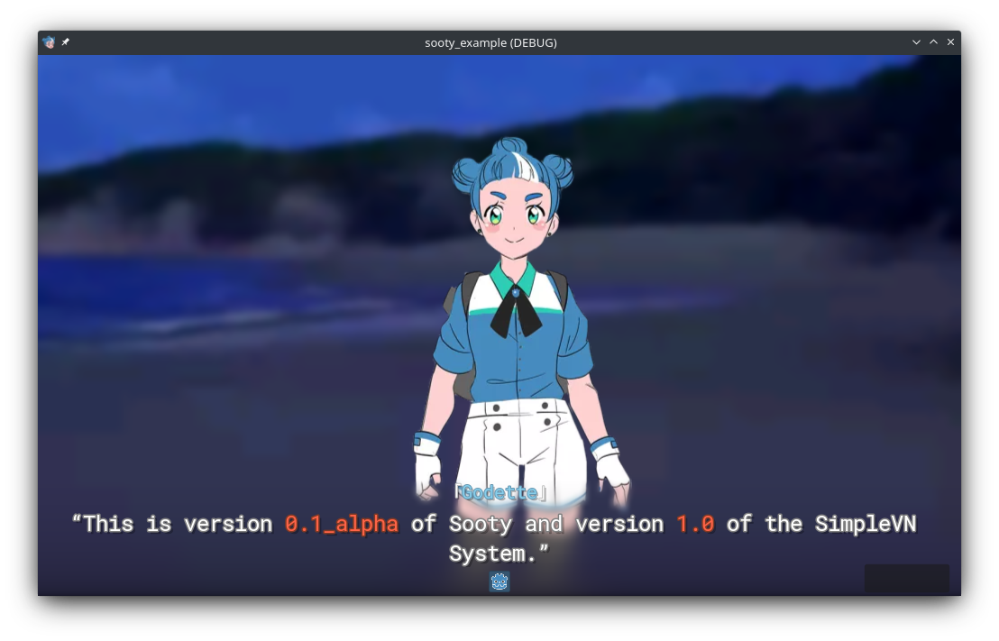

# Sooty - Example VS
A visual story/novel, built with [Sooty](https://github.com/teebarjunk/sooty) and [Godot 4](https://godotengine.org/).

Early alpha. About as unstable as Godot 4.

Press `Q` to toggle the debug menu.

# Features

## Save + Load

## States + Mods
## Dialogue
## BBCode Evolved
## Inventory/Equipment System
## Quests
## Achievements
